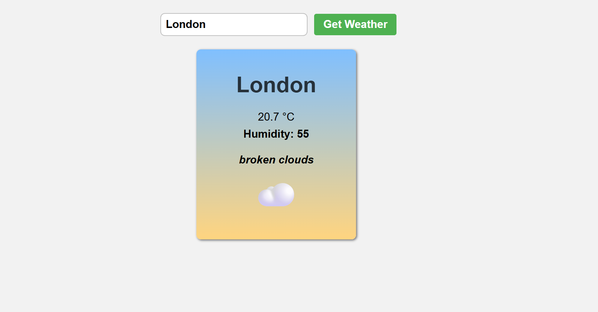
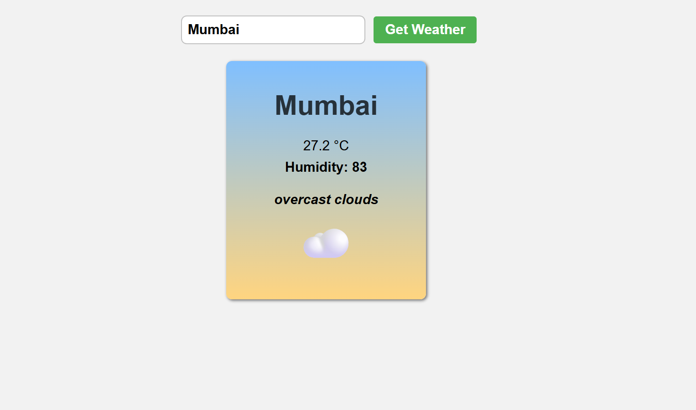
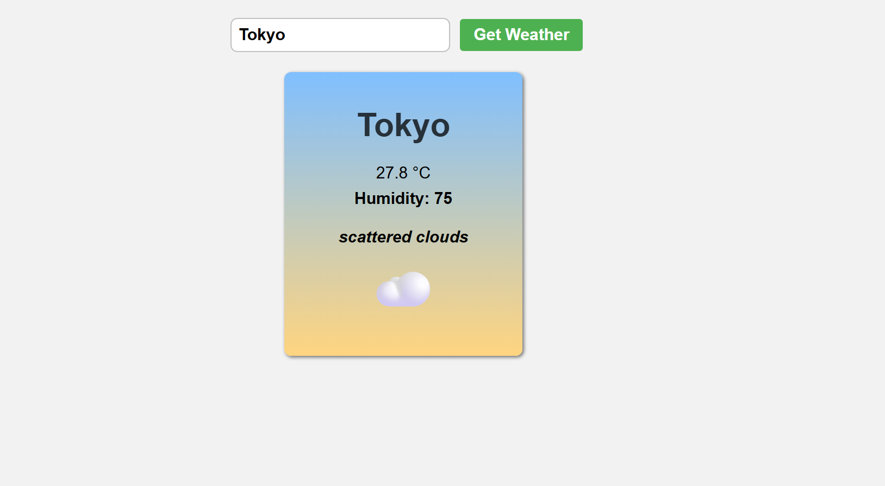
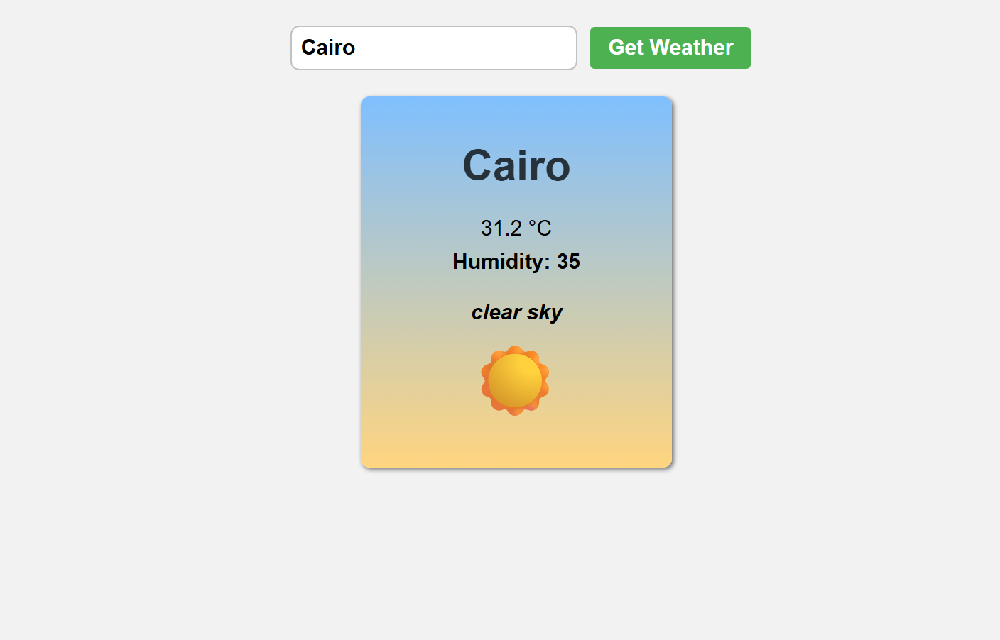

# 🌦️ Weather App

A simple and elegant weather application where users can enter a city name and instantly view its current weather details, including temperature, humidity, and a brief condition description. Built with HTML, CSS, and JavaScript using the OpenWeatherMap API.

---

## 🖼️ Preview

---

## 🔍 Features

- 🌍 Search weather by city name
- 🌡️ Displays current temperature in Celsius
- 💧 Shows humidity percentage
- ☁️ Shows condition description (e.g., Clear, Rain, Clouds)
- 🛑 Error handling for invalid city input or failed API call
- ⚙️ Uses the OpenWeatherMap API

---

## 💥 Error Handling

- Displays a user-friendly message when:
  - The entered city is not found
  - There's a network/API issue
- Prevents app from breaking due to unexpected responses

---

## 📸 Screenshots

## 🛠️ Tech Stack

- HTML5
- CSS3
- JavaScript (ES6+)
- OpenWeatherMap API

---

## 🧑‍💻 Author

- **Nikunj** – [GitHub Profile](https://github.com/Nikunj-52147)

---